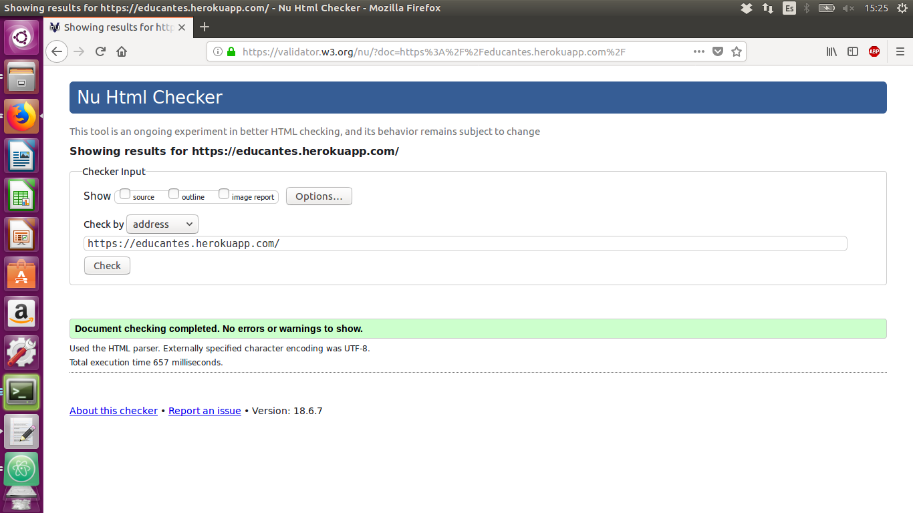
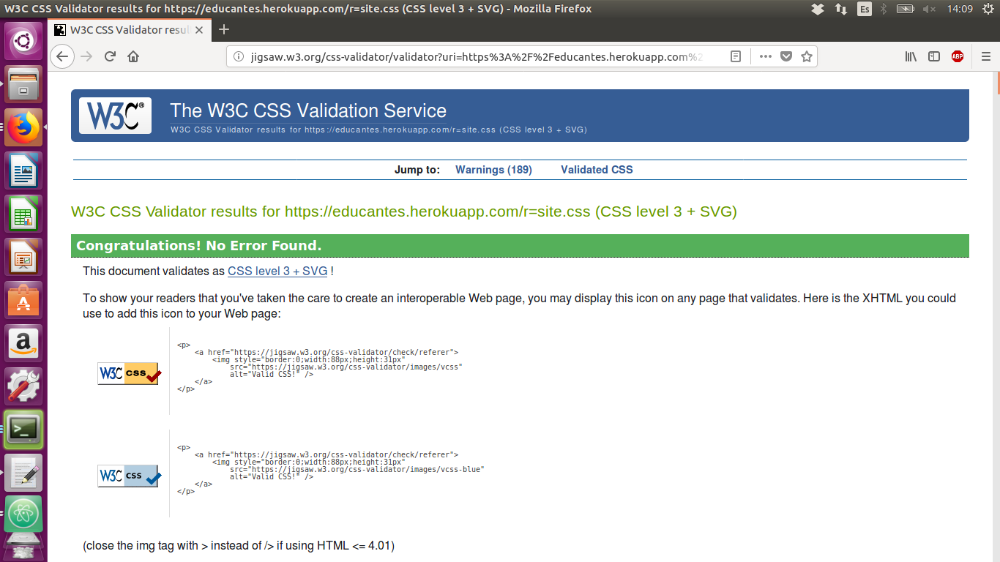

# Anexos

## R(22) Validador HTML

## R(23) Validador Css

## R(58) Prueba del seis

1. ¿Que sitio es éste? (Identificador del sitio)

    Se trata del sitio web Educantes para un grupo de colegios privados/concertados.
    En todo momento aparece el nombre Educantes arriba a la izquierda,

2. ¿En que página estoy? (Nombre de la página)

    En todas las paginas aparece la migas de pan que te muestra donde estas , en algunas tienes un titulo con el nombre de la pagina

3. ¿Cuales son las principales secciones del sitio? (Secciones)

    Las secciones de la web se encuentran arriba en el menu , dependiendo del rol del usuario se mostraran unas o otras

4. ¿Que opciones tengo en este nivel? (Navegación local)

    La navegación local dentro de cada nivel del sitio siempre se realiza a través de botones o enlaces.

5. ¿Donde estoy en el esquema de las cosas? (Indicadores de "Usted está aquí")

    La web dispone en todo momento de "migas de pan" para tener al usuario informado de donde se encuentra dentro del mapa de la web.

6. ¿Como busco algo? (Buscador)

    La web dispone en la parte de la tienda de un buscador pra encontrar mas facilmente un producto

## R(26) Uso de microdatos

