# Manual de usuario

## Manual de usuario Administrador general

Para todas estas acciones sera necesario estar conectado con el usuario administrador general

### Gestionar colegios

Para ello Pulsamos en colegios y elegimos gestionar colegios
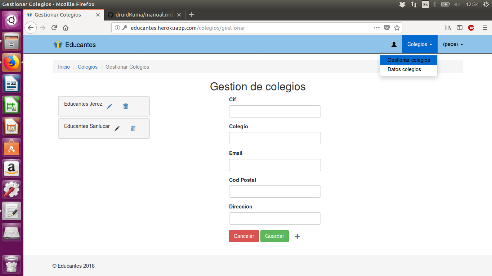

Luego podras modificar colegios ya existentes, borrarlos o crear un colegio nuevo despues de elegir lo
que quieres hacer y de rellenar el formulario solo tienes que presionar el boton guardar y ya esta
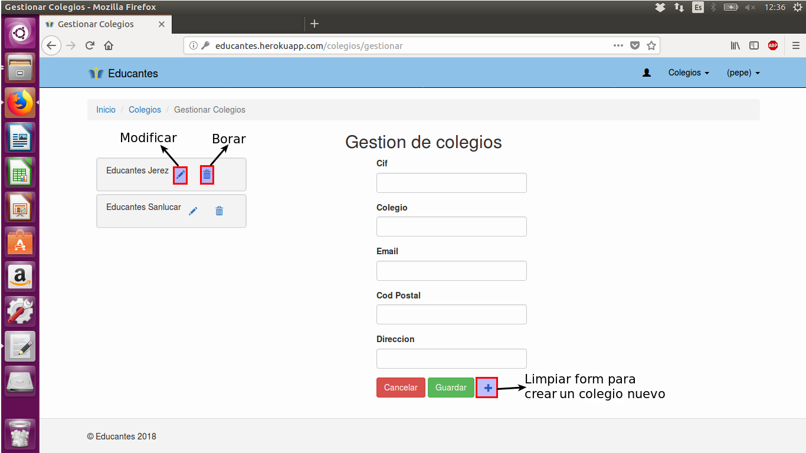

### Dar de alta usuario administrador de colegio

Para ello Pulsamos en colegios y elegimos Datos colegios, y estando ahi podras dar de alta a un administrador
si no existe ya alguno en ese colegio
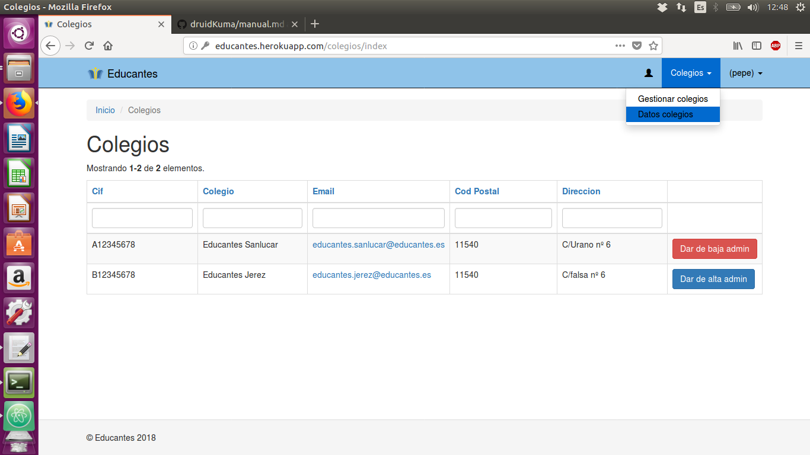

### Gestionar usuarios

Al ser un administrador general podra gestioar todos los usuarios ya sea para cambiarles la contraseña o 
para borrarlos si hay algun problema
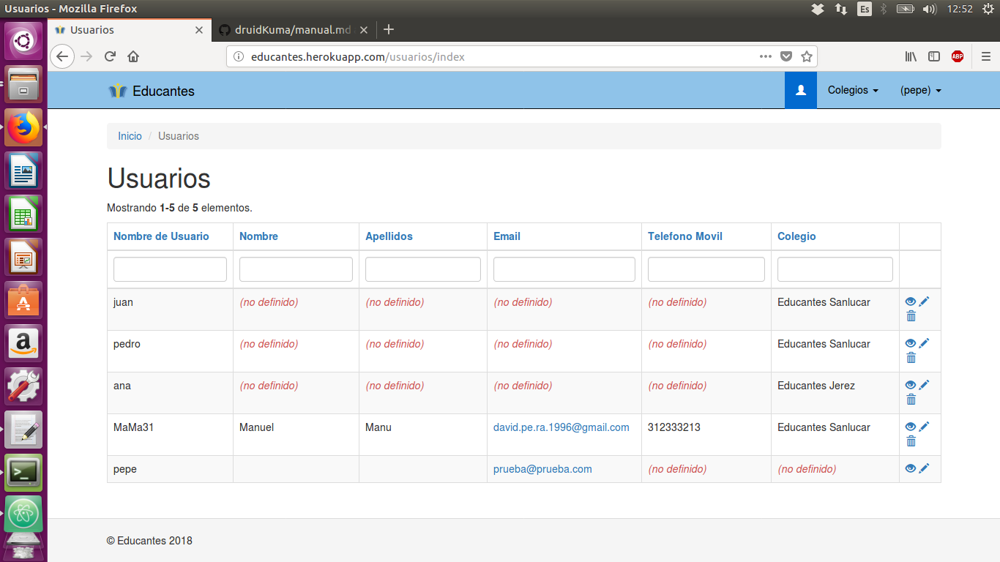

## Manual de usuario Administrador de colegio

Para todas estas acciones sera necesario estar conectado con el usuario administrador de colegio

### Insertar datos

Este usuario podra insertar un archivo xlsx ya sea para uniformes, libros, alumno o tutores. Pulsando en una de las cosas que
quiera insertar y eligiendo la opcion de insertar, en la pagina de insercion viene bien explicado los campos que debe tener 
el archivo y como ponerlo
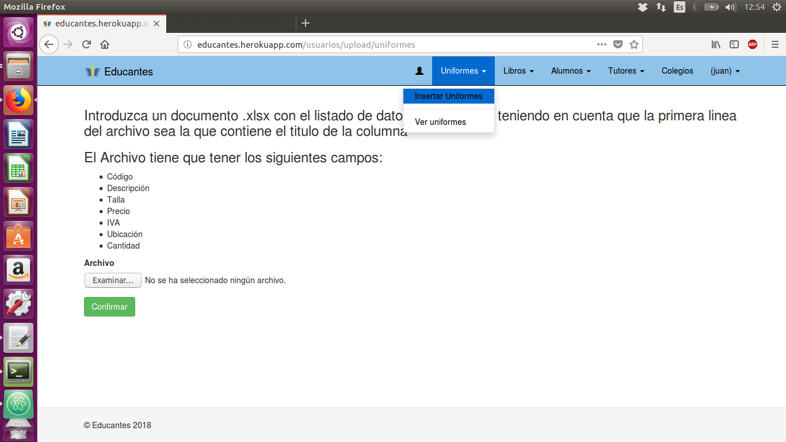

### Introducir datos

También es posible introducir los datos a mano Pulsando en una de las cosas que a las que quiera añadir algo y eligiendo
la opcion de ver, en esa pagina podras añadir, modificar y borrar esas cosas a mano

### Dar de alta usuario padre

En ver tutores ademas de poder gestionar a los tutores tambien puedes darles de alta como padre pulsando el boton
dar de alta que tienen al lado, si ya estan dados de alta tendras un boton para darlos de baja
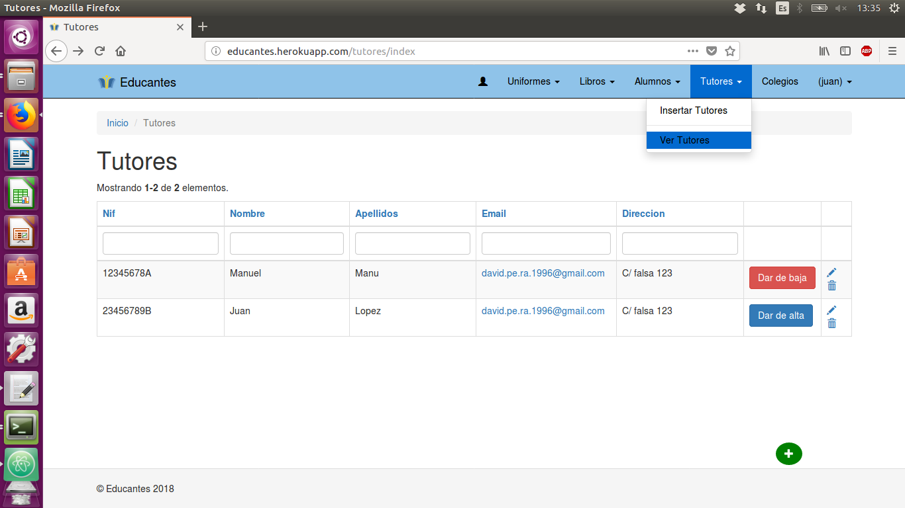

### Dar de alta usuario vendedor

Pulsando el boton de colegios te vas a una lista de los colegios que existen. Al lado de tu colegio tendras un boton para dar
de alta al vendedor, si ya esta dado de alta sera un boton para dar de baja

### Añadir stock de seguridad a un uniforme

En ver uniformes a parte de poder gestionar uniformes podras añadirles un stock de seguridad a traves del boton de al lado

Al pulsar el boton te manda a un formulario donde podras rellenar los datos necesarios y entonces lo guardaras dandole al
boton guardar, una vez el stock de seguridad esta añadido el boton se comvierte en uno de modificar

### Gestionar usuarios

Este usuario podra gestionar otros usuarios al igual que el administrador general, la diferencia es que este solo podra
administrar los usuarios de su colegio. El boton para entrar y la distribucion de la pagina son iguales a las del Administrador general

## Manual de usuario Vendedor

Para todas estas acciones sera necesario estar conectado con el usuario vendedor de colegio

### Gestionar uniformes

Este usuario podra gestionar los uniformes de su colegio. Pulsando en el boton uniormes y dentro eligiendo la pestaña mi colegio
podra hacer las mismas acciones sobre los uniformes que el administrador de colegio inclusive el stock de seguridad

### Hacer pedidos a otros colegios

Con el boton uniformes pero esta vez en la pestaña otros colegios el usuario podra realizar distintos tipos de pedidos a otros colegios
podra realizar pedidos simples de un solo tipo de uniforme en el boton hacer pedido que aparece al lado del uniforme

Una vez pulsado el boton aparecera un campo en el que podra poner cuanta cantida de ese uniforme quiere pedir, para completar el
pedido tendra que pulsar el boton con un tick en el caso de qe no quiera hacerlo podra pulsar el boton con una equis
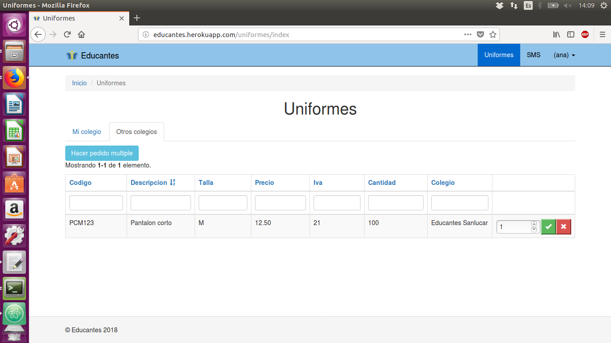

### Hacer pedido multiple

El otro pedido que se puede realizar incluso a varios colegios a la vez es el pedido multiple, pulsando el boton que pone hacer pedido
multiple empezara a formarlo
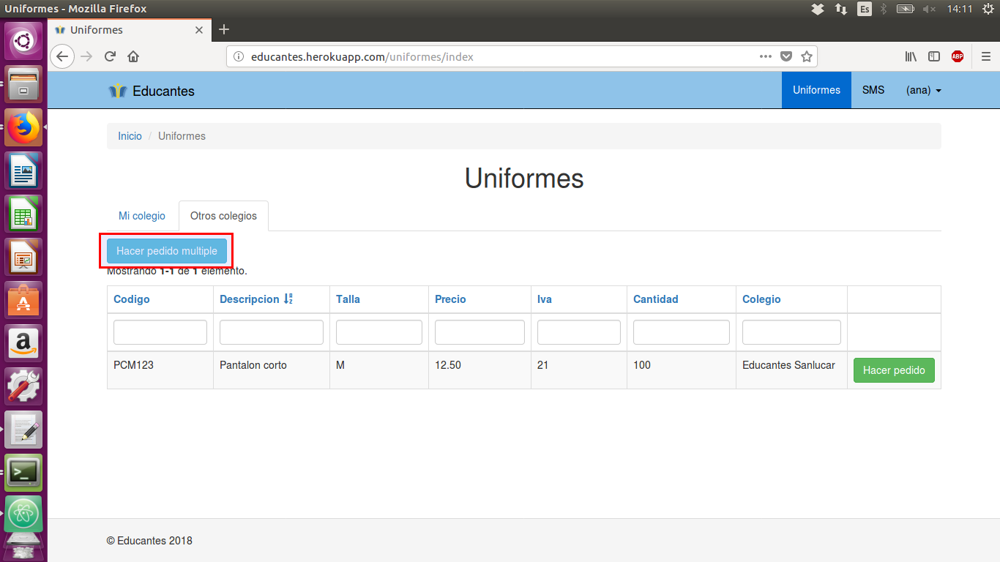

Una vez pulsado el boton le aparecerá una ventana emergente en la cual podra añadir colegios al pedido, lo cual generara un select donde
podra elegir el colegio y lo terminara de elegir pulsando el tick de al lado

Una vez elegido el colegio debajo del nombre de este aparecera un boton para añadir articulos que se podra pulsar más de una vez para
añadir más de un articulo
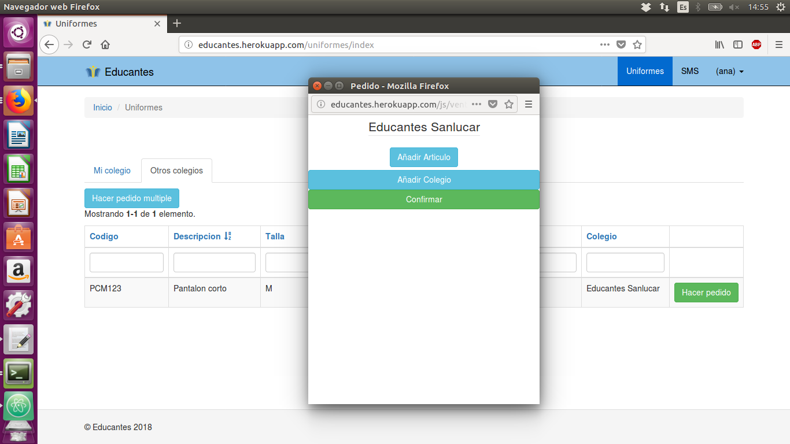

Al pulsarlo aparecera un select para elegir el codigo de l uniforme a pedir y un campo para elegir la cantidad, siempre podra quitar un
articulo con la equis de al lado. Una vez puesto todos los articulos podra pulsar el boton confirmar el cual realizara el pedido
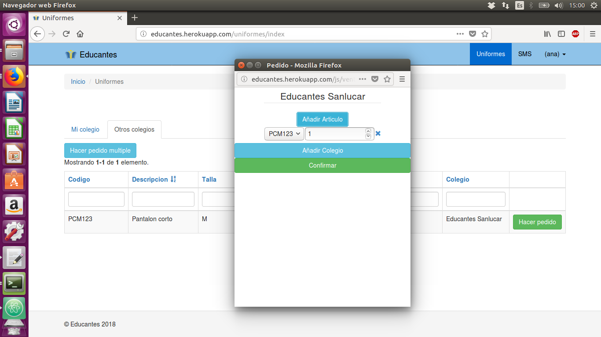

## Manual de usuario Padre

Para todas estas acciones sera necesario estar conectado con un usuario padre

### Añadir productos al carro

Pulsando en productos parareceran todos los productos del colegio del usuario logueado, en esta pagina puede buscar cualquier producto
por su descripcion.

### Gestionar el carro

Pulsando en el icono del carro podra entrar en su carro de la compra donde podra quitar productos que no quiera que esten en el carro
y donde podra realizar el pedido a su colegio
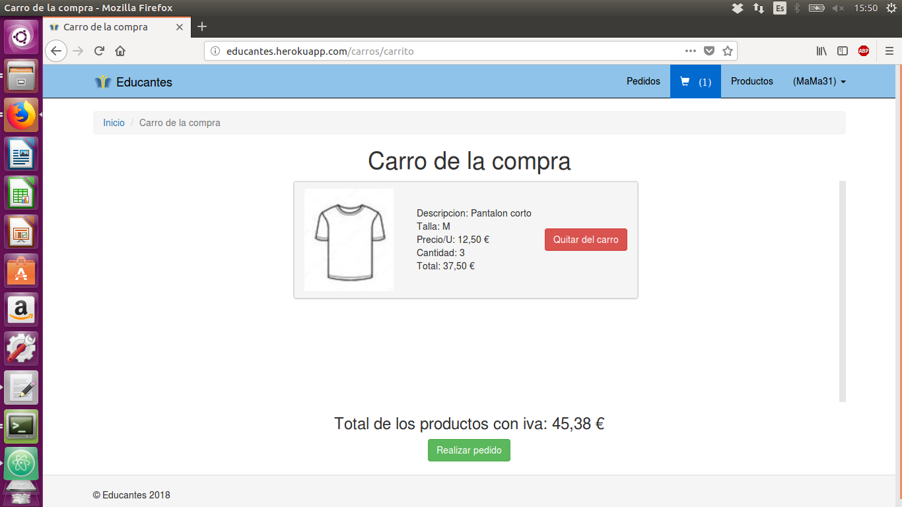

### Ver pedidos realizados

El padre podra ver todos los productos que ha pedido, en estos aparecerá la fecha en la que fueron pedidos y si un vendedor los a
confirmado ya o no, lo cual le informara al padre que pedidos no puede recoger y cuales si
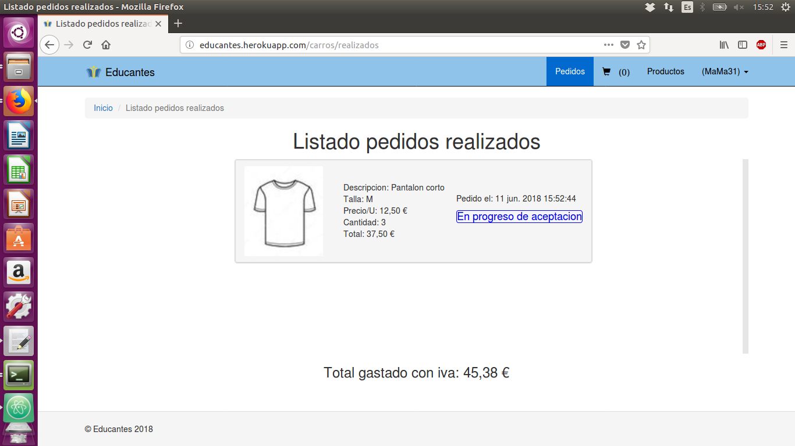

